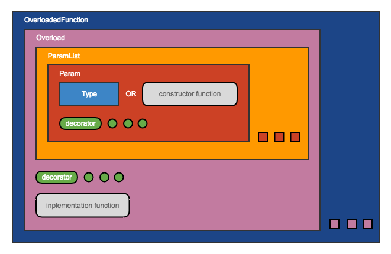

#	overload2
__Elegant solution for function overloading in JavaScript.__

When you are tired with writing tasteless code to do with arguments, *overload2* will __MAKE THINGS EASY__.

On programming with strongly-typed languages such as C++ and Java, [function overloading](https://en.wikipedia.org/wiki/Function_overloading) is frequently employed to make API more convenient to be used. As a weakly-typed language, JavaScript does not support function overloading. At the same time, fortunately, functions in JavaScript may be passed with any arguments that is why  *overload2* is feasible.

##	Table of contents

*	[Get Started](#get-started)
*	[Datatypes](#datatypes)
*	[Mutable Parameter](#mutable)
*	[Move Forward](#move-forward)
*	[APIs](#apis)
* 	[Examples](#examples)
*	[Why overload2](#why-overload2)
*	[Honorable Dependents](#dependents)
*	[About](#about)
*	[References](#references)

##	Links

*	[CHANGE LOG](./CHANGELOG.md)
*	[Homepage](https://github.com/YounGoat/ecmascript.overload2)

<a name="get-started"></a>
##	Get Started

Install *overload2* firstly.

```bash
# Install overload2 and save as a dependency of current package.
npm install overload2 --save
```

Open node and run next code:

```javascript
const overload2 = require('overload2');

// Create a function with overloaded implementations.
var getDay = overload2()
	// Create an overloaded implementation with method overload().
	// The last argument is the implementation function,
	// and the previous is/are used to qualify the datatypes or number of real arguments.
	.overload(
		Date, // consturctor function
		function foo(d) { return d.getDay(); }
	)
	.overload(
		'string', // predefined datatype
		function bar(s) { return new Date(s).getDay(); }
	)
	.overload(
		'number', 'number', 'number',
		function quz(year, month, date) { return new Date(year, month - 1, date).getDay(); }
	)
	.overload(
		2, // length of arguments
		function md(month, date) {
			var d = new Date;
			return d.setMonth(month - 1), d.setDate(date), d.getDay();
		}
	)
	.overload(
		'*', Date, '*',
		function select(some, d, others) {
			return d.getDay();
		}
	)
	;

getDay(new Date);
// foo(d) invoked

getDay('2000-1-1');
// bar(s) invoked

getDay(2000, 1, 1);
// quz(year, month, date) invoked

getDay(12, 1);
// md() invoked

getDay('foo', 'bar', new Date, 'quz');
// select() invoked
```

<a name="datatypes"></a>
##	Datatypes

According to *overload2* , there are different ways to define a datatype.

*	[Constructor Function](#constructor-function)
*	[Customized Datatype](#customized-datatype)
*	[Predefined Datatype](#predefined-datatype)
*	[Datatype Alias](#datatype-alias)
*	[Create Datatype With Factory Method](#create-datatype-with-factory-method)

###	Constructor Function

*overload2* can match any instance with its constructor function, e.g. `[0,1]` is matched with `Array`. See another example:

```javascript
var getDay = overlaod2()
	.overload(Date, function foo(d) { return d.getDay(); })
	.overload(String, function bar(s) { return new Date(s).getDay(); })
	;

getDay(new Date);  // foo() invoked
getDay(new String('2000-1-1'));  // bar() invoked
```

###	Customized Datatype

You may create customized datatypes by `new overload2.Type(fn)`, e.g.

```javascript
// Create a Type object.
var MonthName = new overload2.Type(function(value) {
	var names = ['Jan', 'Feb', 'Mar', 'Apr', 'May', 'Jun', 'Jul', 'Aug', 'Sep', 'Oct', 'Nov', 'Dec'];
	return names.indexOf(value) >= 0;
});

// Customized type may be used on overloading.
var getDay = overlaod2()
	.overload(Date, function foo(d) { return d.getDay(); })
	.overload('number', MonthName, 'number', function() {
		return new Date(year, month - 1, date).getDay();
	})
	;

getDay(2000, 'Jan', 1);
```

###	Predefined Datatype

| Predefined Data Type            | Remark |
| :----------------------------   | :------------- |
| __overload2.Type.ANY__          | Anything. |
| __overload2.Type.BOOLEAN__      | It must be `true` or `false`, anything else including instance of `Boolean` is unmatched. |
| __overload2.Type.CHAR__         | A string whose length equals 1, e.g. "a" |
| __overload2.Type.NUMBER__       | A number, but NOT instance of `Number`. |
| __overload2.Type.PLAIN_OBJECT__ | An object whose constructor is `Object` instead of anything else. |
| __overload2.Type.SCALAR__       | A number, string or boolean, but NOT instance of `Number`, `String` or `Boolean`. |
| __overload2.Type.STRING__       | A string, but NOT instance of `String`. |

ATTENTION:

1.	Predefined datatypes named `Type.BOOLEAN`, `Type.NUMBER` and `Type.STRING` refers to primitive values with types of `boolean`, `number` and `string`, not their Object-wrapped forms. If Object-wrapped form required, just directly use constructor functions `Boolean`, `Number` and `String` as datatype, see [Datatypes: Constructor Function](#constructor-function).

1.	Before version 0.1.0, predefined datatypes are appended directly to the `overload2` module. To avoid ambiguity in future, predefined datatypes will be appended to `overload2.Type`. Although the old ones reserved, it's strongly suggested not to use `overload2.<PREDEFINED_TYPE_NAME>` any longer.

###	Datatype Alias

ATTENTION: Datatype aliases are __CaseSensitive__ strings.

| Alias      | Corresponding Datetype          |
| :--------- | :------------------------------ |
| ?          | __overload2.Type.ANY__          |
| any        | __overload2.Type.ANY__          |
| boolean    | __overload2.Type.BOOLEAN__      |
| char       | __overload2.Type.CHAR__         |
| number     | __overload2.Type.NUMBER__       |
| object     | __overload2.Type.PLAIN_OBJECT__ |
| scalar     | __overload2.Type.SCALAR__       |
| string     | __overload2.Type.STRING__       |

###	Create Datatype With Factory Method

*overload2* offers some factory methods to create frequently used datatypes, e.g. enum.

*	__overload2.Type.enum(item [, ...])__  
	Return an enumeration type.

*	__overload2.Type.and(type1, type2 [, ...])__  
	Create a compound type.

*	__overload2.Type.or(type1, type2 [, ...])__  
	Create a compound type.

*	__overload2.Type.not(type)__  
	Create a new type which is complementary to the origin type.

<a name="mutable"></a>
##	Mutable Parameter

By appending size decorator, we can define mutable parameters. E.g.

```javascript
var add = overload2()
	.overload('number *', function(numbers) {
		var ret = 0;
		numbers.forEach(function(number) { ret += number; })
		return ret;
	})
	.overload('boolean {2,3}', function(bools) {
		var ret = false;
		for (var i = 0; !ret && i < bools.length; i++) {
			ret = bools[i];
		}
		return ret;
	})
	.overload([ Date, '+' ], function(dates) {
		var date = dates[0];
		for (var i = 1; i < dates.length; i++) {
			if (date < dates[i]) {
				date = dates[i];
			}
		}
		return date;
	})
	;
```

Size decorators look like [repetition in regular expression](http://www.regular-expressions.info/repeat.html). Here are some examples for overload param with size decorators:

```javascript
[ Date, '{2,}']  // takes at least 2 arguments which are instances of Date

'number *'  // takes any number (including zero) of arguments of type number
'*'         // takes any number (including zero) of arguments of any type
'+'         // takes at least one argument
'?'         // takes one argument
'{2}'       // takes 2 arguments
'{2,4}'     // takes 2 to 4 arguments
'{2,}'      // takes at least 2 arguments
'{,4{}'     // takes no more than 4 arguments

// The braces may be omitted, so the following are also valid.
'2'
'2,4'
'2,'
',4'
```

<a name="move-forward"></a>
##	Move Forward

Beyond the basic use, *overload2* is also suitable with more complex and large-scale programs. See the class hierarchy shown below:  


The usage of classes in *overload2* is explained in the next table:

| Class                            | Remark     |
| :------------------------------- | :------------- |
| __overload2.OverloadedFunction__ | wrapper of overloaded function, not a function instance itself |
| __overload2.Overload__           | to define overloading implementation |
| __overload2.ParamList__          | to define a parameter list |
| __overload2.Param__              | to define a parameter |
| __overload2.Type__               | wrapper of class (consturctor function), or to customise some datatype  |

Instances of `Type`, `Param`, `ParamList` and `Overload` are able to be created independently and be re-used in creating instances of superior class(es).

Here is an [example](./example/advanced.js) for advanced mode.

<a name="apis"></a>
##	APIs

*	[overload2()](#api-overload2)
*	[class overload2.Type](#api-class-type)
*	[class overload2.Param](#api-class-param)
*	[class overload2.ParamList](#api-class-paramlist)
*	[class overload2.Overload](#api-class-overload)
*	[class overload2.OverloadedFunction](#api-class-overloadedfunction)

<a name="api-overload2"></a>
###	overload2(), Create An Overloaded Function

`overload2` itself is a function, when invoked, it will return an overloded function instance.

*	\<fn\> __overload2__()  
	Create a new overloaded function. The function has no implementations before `.overload()` called.

*	\<fn\> __\<fn\>.overload__( [ \<datatype\>, ... ] function \<implementation\> )  
	Append an overloading implementation to existing overloaded function.

*	\<fn\> __\<fn\>.default__( function \<implementation\> )  
	Set default implementation function for existing overloaded function.

<a name="api-class-type"></a>
###	class overload2.Type

To define a datatype in context of *overload2*, there are different ways including `overload2.Type`. And all other datatypes will be converted to instances of `overload2.Type` before being used.

*	new __overload2.Type__( function | RegExp \<matcher\> )  
	Here `matcher` may be a function or RegExp object.

*	*private* boolean __\<type\>.match__( \<value\> )  
	Return `true` if value matches the datatype, otherwise return `false`.

<a name="api-class-param"></a>
###	class overload2.Param

A Param is made up of  a Type and some decorators. Available decorators are:

| Decorator    | Remark |
| :----------- | :------------- |
| null         | If argument equals null, it matches the parameter. |
| undefined    | If argument equals undefined (the place should be occupied), it matches the parameter. |
| absent       | The argument may be absent (optional). See [example code](./example/optional.js) for more details. |

*	new __overload2.Param__( string "\<alias\> \<decorator\> ..." )  
	The `alias` should be one of alias listed in table [Datatype Alias](#datatype-alias).  

*	new __overload2.Param__( Type | function | string \<datatype\>, string \<decorator(s)\> [ , string \<decorator(s)\> ] )  
	Here `datatype` may be instance of `Type`, or construtor function, or datatype alias.

* 	*private* boolean __\<param\>.satisfy__( \<value\> )  
	To judge if the argument value satisfy the parameter.

* 	Param __overload2.Param.parse__( ? )  
	Arguments suitable for `new Param()` are also suitable for the `Param.parse()`.

<a name="api-class-paramlist"></a>
###	class overload2.ParamList

*	new __overload2.ParamList__( [ Param | Array | String \<param\> [ , ... ]  ] )  
	Here `param` may be an instance of `Param`, or a string or an array which may used as argument(s) for `new Param()`.

* 	*private* boolean __\<paramList\>.satisfy__( Array | Arguments \<args\> )  
	To check arguments with parameters, return `true` if matched or `false` if not.

* 	ParamList __overload2.ParamList.parse__( ? )  
	Arguments suitable for `new ParamList()` are also suitable for the `ParamList.parse()`.

<a name="api-class-overload"></a>
###	class overload2.Overload

*	new __overload2.Overload__( number <argumentsNumber>, function \<implementation\> )  
	Create an `Overload` instance by restricting the number of arguments.

*	new __overload2.Overload__( ParamList, function \<implementation\> )  
	Create an `Overload` instance bound to specified `ParamList`.

*	new __overload2.Overload__( \<param\> [ , ... ] , function \<implementation\> )  
	Create an `Overload` instance with optional definitions of `Param`.

*	new __overload2.Overload__(function \<implementation\> )  
	Create an `Overload` instance which will be invoked while arguments length equals 0.

*	Overload __overload2.Overload.parse__( ? )  
	Arguments suitable for `new Overload()` are also suitable for the `Overload.parse()`.

<a name="api-class-overloadedfunction"></a>
###	class overload2.OverloadedFunction

*	new __overload2.OverloadedFunction__()  
	The instance of `OverloadedFunction` is a wrapper, not a function itself.

*	__\<wrapper\>.exec__( ... )  
	Run the overloaded function.

*	__\<wrapper\>.apply__( \<scope\>, Array | Arguments \<args\> )   
	Run the overloaded function under specified scope, passing arguments as an array or Arguments instance.

*	__\<wrapper\>.call__( \<scope\> [ , \<arg\> [ , ... ] ] )  
	Run the overloaded function under specified scope, passing arguments one by one.

* 	__\<wrapper\>.overload__( Overload \<overloadInstance\> [ , Boolean <setAsDefault> ] )  
	Append an overloading implementation.

*  	__\<wrapper\>.overload__( ? )  
	Append an overloading implementation, arguments suitable for `new Overload()` are also suitable for the `<wrapper>.overload()`.

<a name="examples"></a>
##	Examples

*	[Basic Usage](./example/basic.js)   
	To create overloaded function in simple way.

*	[Unit Test](./test/)  
	Another way to understand *overload2* is via reading unit-test code. To run the unit test on the local installed module, please:

	```bash
	# Change to the installing directory of overload2.
	cd node_modules/overload2

	# To install devDependencies.
	npm intall

	# Run test.
	npm test
	```

* 	[Overloaded Constructor Function](./example/constructor.js)   
	Overloaded function created by *overload2* may also be used as class constructor.

*	[Run Overloaded Function Under Specified Scope](./example/scope.js)  
	A function created by *overload2* may also be invoked by `.apply()`, `.call()`, as normal functions do. And, it may also be bound to specified scope with `.bind()`.

*	[Mutable Parameters](./example/mutable.js)  
	Explain how to define mutable parameters.

*	[Optional Parameters](./example/optional.js)  
	Explain show how to indicate a param which may be absent (that means it is optional), and how to set the default value.

*	[Parameter Decorators](./example/param-deco.js)  
	Introduce available decorators used to define a more complex parameter.

*	[Advanced Usage](./example/advanced.js)  
	Use *overload2* in complex situations.

<a name="why-overload2"></a>
##	Why overload2

There have been dozens of packages devoted to function overloading in JavaScript, and some of them are really not bad, e.g.

*	[overloadable](https://www.npmjs.com/package/overloadable)
*	[polymorphic](https://www.npmjs.com/package/polymorphic)
*	[overload-js](https://www.npmjs.com/package/overload-js)
*	[variadic](https://www.npmjs.com/package/variadic.js)
*	...

So, is *overload2* redundant? I donnot know. Each of previous is unsatisfactory more or less, of course *overload2* is not perfect either. Maybe future ECMAScript specification will support function overloading. However, until then, I will depend on *overload2* while coding in JavaScript.

<a name="dependents"></a>
##	Honorable Dependents

Welcome to be the first dependent of *overload2*!

##	About

[](https://www.npmjs.com/package/overload2)

Why postfixed the package name with number 2? Since name "overload" has been occupied, inspired by well-known package "pm2" and "through2", I thought "overload2" is not bad. The most important reason why I choose "overload2" was because 2 /tu:/ is pronounced like tool /tu:l/.

##	References

*	MSDN: [Overloading and Signatures](https://msdn.microsoft.com/en-us/library/aa711868.aspx)
*	MSDN: [Signatures and overloading](https://msdn.microsoft.com/en-us/library/aa691131.aspx)
*	StackOverflow: [What is an “internal slot” of an object in JavaScript?](http://stackoverflow.com/questions/33075262/what-is-an-internal-slot-of-an-object-in-javascript)
